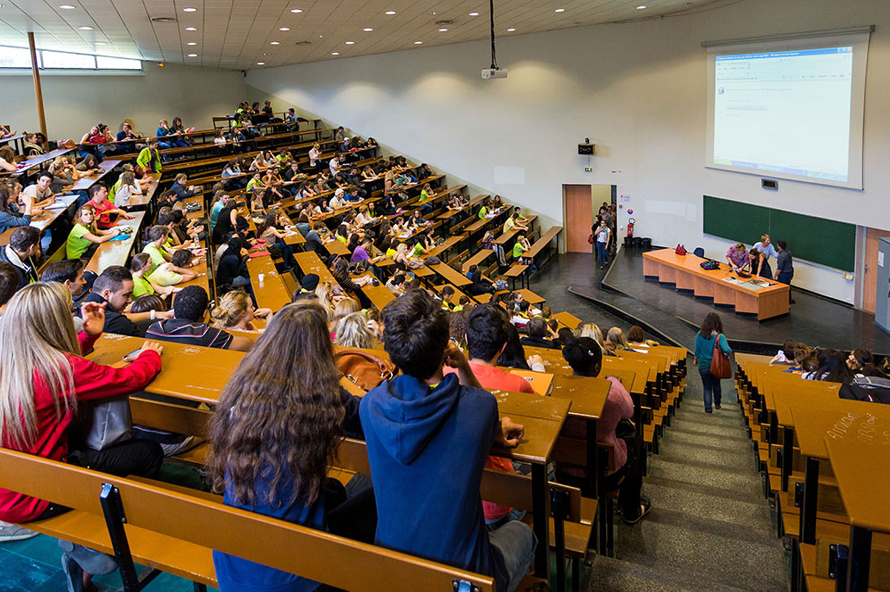

Cette application présente une étude faite dans deux université du Portugal.  
On cherche à analyser les notes des élèves en fonction de différents attributs (par exemple l'âge, le sexe, le milieu urbain etc... )  
L'application pourrait être reprise par différentes écoles pour analyser les résultats de leurs élèves en fonction de divers critères pour ainsi leurs apporter un meilleur soutien.
